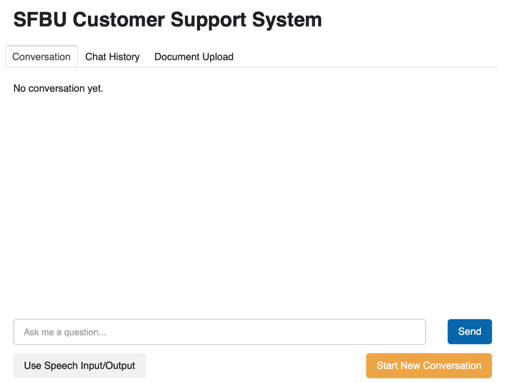

# Speech-Enabled Chatbot with Document Processing

## Overview
This project is a speech-enabled chatbot integrated with various document processing capabilities. The chatbot can interact through text or voice input and process different types of documents (e.g., PDFs, PPTs, YouTube videos). It utilizes OpenAI's GPT-4 model for question-answering tasks, LangChain for document retrieval, and PyDub for speech synthesis.

The chatbot also supports voice input/output using speech recognition and text-to-speech (TTS) technologies, making it suitable for hands-free operation.


## Features
- **Speech Input/Output**: Use voice commands to interact with the chatbot, enabling a hands-free experience.
- **Document Processing**: Upload PDFs, PPTs, URLs, or YouTube videos to extract and analyze text.
- **Custom Question Answering**: Use retrieved context to answer questions concisely and accurately.
- **Dynamic Memory and Context Management**: Track conversation history and context dynamically.
- **GUI Interface**: A graphical user interface (GUI) for easy interaction with the chatbot and document upload features.

## Requirements
- Python 3.7+
- OpenAI API key
- Required libraries: langchain, pydub, panel, param, and other dependencies

## Installation

### Clone the Repository
```bash
git clone https://github.com/your-repository/chatbot.git
cd chatbot
```

### Install Dependencies
```bash
pip install -r requirements.txt
```

### Environment Setup
Create a `.env` file in the root of the project and add your OpenAI API key:
```
openai_api_key=YOUR_API_KEY_HERE
```

## Running the Application
Start the application by running:
```bash
python chatbot.py
```
The application will start a web interface using Panel for interaction.

## Usage
- **Text Input**: Type queries in the input box and press "Send"
- **Speech Input**: Toggle "Use Speech Input/Output" to enable voice interaction
- **Document Processing**: 
  - Upload PDF, PPT, URL, or YouTube link
  - Click respective processing buttons
- **Start New Conversation**: Use "Start New Conversation" button to reset chat history

## Code Structure
- `chatbot.py`: Main script to initialize and run the chatbot
- `speech_recognition.py`: Handles speech input and transcription
- `document_processing.py`: Handles document processing tasks
- `langchain_integration.py`: Manages LangChain interactions
- `ui.py`: Defines Panel GUI components

## Speech Recognition
Uses `speech_recognition` library for transcription and gTTS for text-to-speech synthesis.

## Dependencies
- openai
- langchain
- pydub
- panel
- param
- gTTS
- speech_recognition
- python-dotenv

## License
MIT License

## Acknowledgements
- OpenAI's GPT-4
- LangChain
- Pydub and gTTS