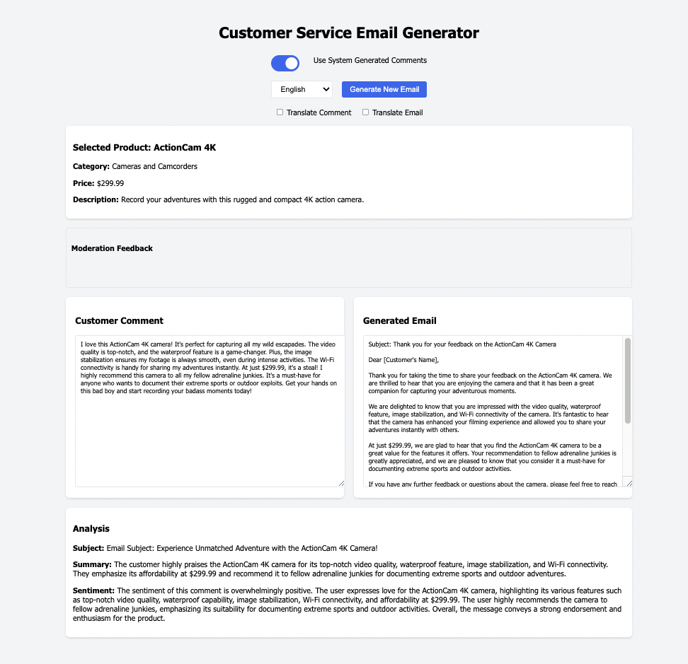

# Customer Support System with Multilingual Capabilities and Moderation

## Project Overview

This project aims to create a comprehensive customer support system utilizing advanced AI techniques. It offers features that streamline the workflow for customer service assistants while ensuring a positive customer experience. This system caters to large electronics stores, allowing customer service representatives to interact with clients in their preferred language. It provides support for various product categories, delivering detailed descriptions and tailored assistance based on user inquiries.

## Key Functionalities

- **Multilingual Support:** Interact with customers in various languages through seamless translation functionalities.
- **Input Moderation:** Ensure customer comments are appropriate through OpenAI's moderation API.
- **Classification:** Categorize customer queries based on message content for efficient routing.
- **Chain of Thought Reasoning:** Utilize Chain of Thought reasoning to provide accurate and informative responses to user questions.
- **Evaluation:** Analyze system performance by evaluating generated responses against ideal answers.
- **Product Information Integration:** Integrate product information readily available for reference during customer interactions.

## Implementation Process

The project is implemented in stages, focusing on specific functionalities:

### Step 1: Input Processing - Moderation

- **Check Inappropriate Prompts:**
  - Generate a customer comment about a product using ChatGPT.
  - Utilize OpenAI's Moderation API to identify and flag inappropriate content within the comment.
  
- **Prevent Prompt Injection:**
  - Develop mechanisms to prevent users from manipulating prompts to generate undesirable outputs.

### Step 2: Classification of Service Requests

- Design a system that analyzes user messages and categorizes them based on the service requested (e.g., warranty, return, troubleshooting).

### Step 3: Answering User Questions Using Chain of Thought Reasoning

- Implement Chain of Thought reasoning within the AI model to provide transparent and traceable responses to user queries. Explain the reasoning process behind the answer, fostering user trust.

### Step 4: Evaluation

- Establish a system for evaluating the effectiveness of generated responses using various metrics. Compare these outputs against pre-defined "ideal" answers or evaluate them based on human expert judgment.

### Step 5: Integration with Existing Systems

- Integrate the customer support system with existing product information databases to provide accurate and up-to-date product details during customer interactions.

## Links and Resources

- [Link to Project](https://github.com/juma-paul/customer-support-chatbot/tree/main/email-moderation)
- [Presentation Slides](https://docs.google.com/presentation/d/1PUdRPgvwkGpeLEmMkuaoGF02ZlIyx23pBQpk2diycfc/edit?usp=sharing)

