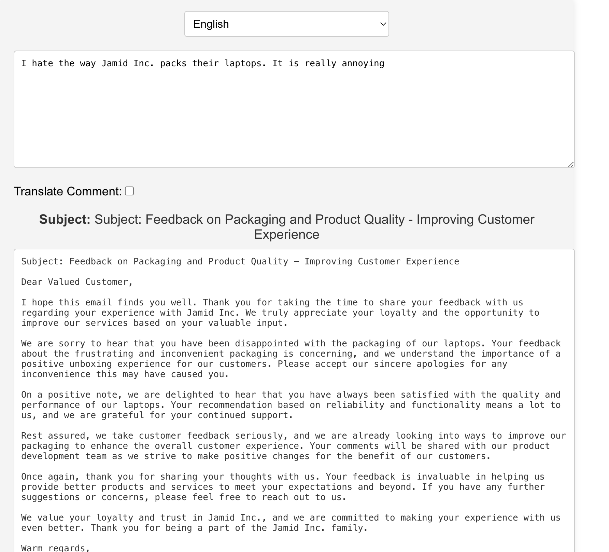
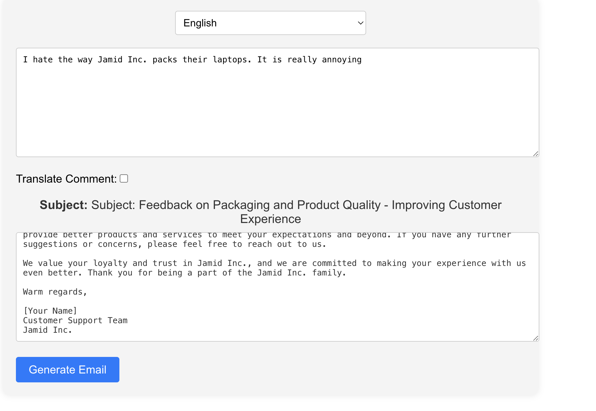
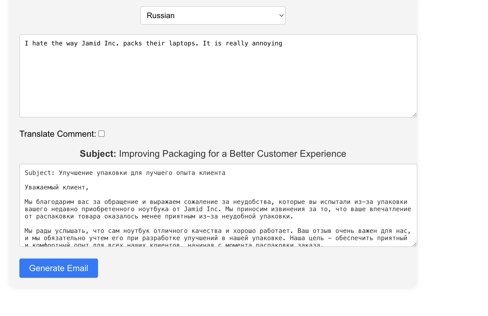
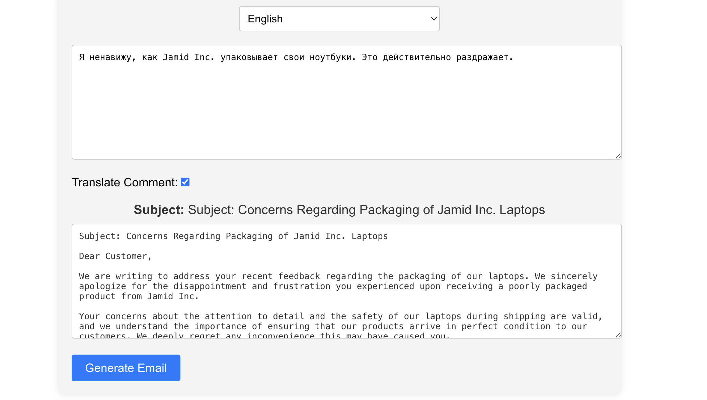
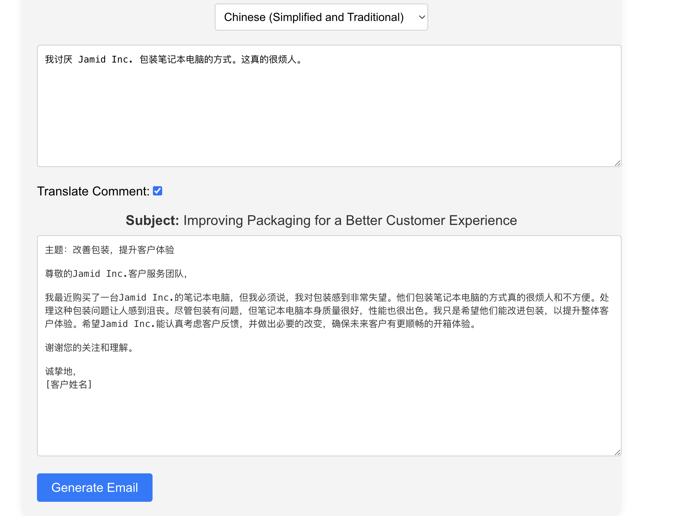

# Automated Email Response System

A sophisticated email response generation system with multi-language support and AI-powered content generation.

## Introduction
- **Purpose**: Automates customer support email responses
- **Technology Stack**: React, Flask, OpenAI API
- **Key Features**: Multi-language support, sentiment analysis, real-time translation

## Design
### Architecture
- **Frontend**: React.js with modern UI components
- **Backend**: Flask REST API
- **AI Integration**: OpenAI GPT models
- **Translation**: Built-in multi-language support

### Key Components
- Language selector (35+ languages)
- Comment analysis system
- Email generation engine
- Translation service

## Implementation
### Frontend Features
```javascript
- Dynamic language selection
- Real-time response generation
- Translation toggle options
- Error handling and loading states
```

### Backend Services
```python
- OpenAI integration
- Comment analysis
- Email generation
- Translation processing
```

## Testing
### API Endpoint Testing

*Figure 1: API endpoint testing results showing successful requests and responses*

### Response Quality Validation

*Figure 2: Response quality metrics and validation results*

### Error Handling Tests

*Figure 3: Error handling and edge case test results*

### Performance Monitoring

*Figure 4: System performance metrics under various loads*

### Cross-browser Testing

*Figure 5: Cross-browser compatibility test results*

## Enhancement Ideas
1. Custom email template system
2. Analytics dashboard
3. Batch processing capability
4. Response quality metrics
5. User feedback integration
6. API rate limiting

## Getting Started
1. Clone the repository
2. Install dependencies: `npm install` (frontend) and `pip install -r requirements.txt` (backend)
3. Set up `.env` with OpenAI API key
4. Run frontend: `npm start`
5. Run backend: `python app.py`

## Dependencies
- React.js
- Flask
- OpenAI API
- Axios
- Flask-CORS

## References
- OpenAI API Documentation
- React.js Documentation
- Flask Documentation
- RESTful API Best Practices

## License
MIT License

Project Link: [Email to customer](https://github.com/juma-paul/customer-support-chatbot/tree/main/email-to-cutomer)

## Presentation
You can view the project presentation [here](https://docs.google.com/presentation/d/12aVB4NvooXxhENyKFiDMbaIGEBaj6-EFcGav9Ws7xB0/edit?usp=sharing).

