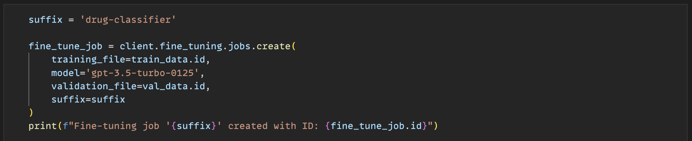
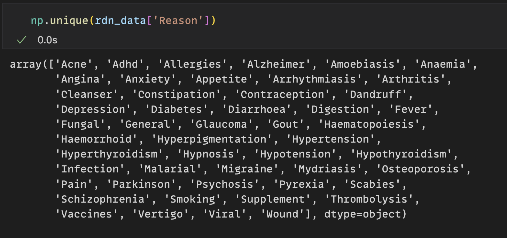

# Drug Classification Model

A machine learning project that fine-tunes GPT-3.5-Turbo to classify pharmaceutical drugs based on their medical uses/maladies.


## Overview

This project processes pharmaceutical data and creates a fine-tuned model capable of classifying drugs according to their therapeutic uses. It utilizes OpenAI's GPT-3.5-Turbo model as the base for fine-tuning.

## Prerequisites

- Python 3.x
- OpenAI API key
- Required Python packages:
  - pandas
  - scikit-learn
  - python-dotenv
  - openai

## Data Structure

Input data should be an Excel file with the following columns:
- Drug_Name: Name of the pharmaceutical drug
- Reason: The medical condition/malady the drug treats
- Description: Additional information (not used in training)

## Setup and Usage

1. Place your pharmaceutical data in an Excel file at `../data/medicine_description.xlsx`
2. Set up your OpenAI API key in a `.env` file
3. Run the script to:
   - Load and preprocess the data
   - Convert data to JSONL format
   - Upload data to OpenAI
   - Create and run a fine-tuning job

## Model Details

- Base Model: gpt-3.5-turbo-0125
- Fine-tuned Model Suffix: drug-classifier
- Training/Validation Split: 80/20
- Data Sample Size: 2000 entries

## Usage Example

```python
response = client.chat.completions.create(
    model="ft:gpt-3.5-turbo-0125:personalapis:drug-classifier:AWD9hDg8",
    messages=[
        {"role": "user", "content": "Drug: [Drug Name]\nMalady:"}
    ],
    max_tokens=10,
    temperature=0
)
```

## Classification Categories

The model classifies drugs into the different categories:


## Link to Project

- Please find link to project [Here](https://github.com/juma-paul/customer-support-chatbot/tree/main/fine-tuning-drug-classification)
