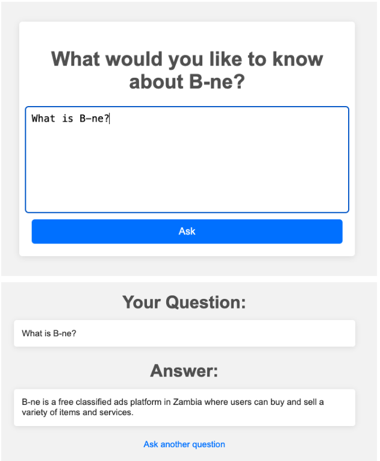

# Customer Support Chatbot

[](https://opensource.org/licenses/MIT)
[](https://www.python.org/downloads/)
[](https://flask.palletsprojects.com/)
[](https://openai.com/api/)

## Introduction

The Customer Support Chatbot is an intelligent chatbot powered by OpenAI's API, designed to crawl any specified website and answer user questions based on the extracted content. It's a Flask-based web application that combines web crawling capabilities with natural language processing.

## Features

- Customizable web crawling functionality to extract content from any specified website
- Integration with OpenAI's API for natural language processing
- User-friendly web interface for asking questions
- Real-time responses based on crawled content
- SSL verification for secure connections
- Efficient text processing and tokenization
- Embedding generation for semantic search

## Demo



## Built With

- [Python](https://www.python.org/) - The primary programming language
- [Flask](https://flask.palletsprojects.com/) - The web framework used
- [OpenAI API](https://openai.com/api/) - For natural language processing
- [Beautiful Soup](https://www.crummy.com/software/BeautifulSoup/) - For web scraping
- [Pandas](https://pandas.pydata.org/) - For data manipulation
- [NumPy](https://numpy.org/) - For numerical computations
- [TikToken](https://github.com/openai/tiktoken) - For tokenization
- [Certifi](https://certifi.io/) - For SSL/TLS certification

## Getting Started

### Prerequisites

- Python 3.7 or higher
- pip (Python package installer)

### Installation

1. Clone the repository:
   ```bash
   git clone https://github.com/juma-paul/customer-support-chatbot.git
   cd customer-support-chatbot/flask-app
   ```

2. Create and activate a virtual environment:
   ```bash
   python -m venv venv
   source venv/bin/activate  # On Windows use `venv\Scripts\activate`
   ```

3. Install required packages:
   ```bash
   pip install -r requirements.txt
   ```

4. Set up environment variables:
   Create a `.env` file in the root directory and add your OpenAI API key:
   ```
   OPENAI_API_KEY=your_openai_api_key
   ```

## Usage

1. Update the `DOMAIN` and `FULL_URL` constants in the main script to point to the website you want to crawl.

2. Run the crawler to extract website content:
   ```bash
   python3 run.py
   ```

3. Open a web browser and navigate to `http://127.0.0.1:5000/`

4. Enter your question in the chat interface and receive AI-powered responses based on the crawled content.

## How It Works

1. **Web Crawling**: The application crawls the specified website, extracting text content from various pages.
2. **Data Processing**: Extracted text is cleaned, tokenized, and split into manageable chunks.
3. **Embedding Generation**: Text chunks are converted into embeddings using OpenAI's API.
4. **User Interface**: A simple web interface allows users to input questions.
5. **Question Answering**: When a question is asked, the application:
   - Generates an embedding for the question
   - Finds the most relevant text chunks using cosine similarity
   - Creates a context from these chunks
   - Sends the context and question to OpenAI's API for an answer
   - Displays the answer to the user

## Contributing

Contributions are welcome! Please feel free to submit a Pull Request.

1. Fork the project
2. Create your feature branch (`git checkout -b feature/my_feature`)
3. Commit your changes (`git commit -m 'Add some my_feature'`)
4. Push to the branch (`git push origin feature/my_feature`)
5. Open a Pull Request

## License

This project is licensed under the MIT License - see the [LICENSE](https://opensource.org/licenses/MIT) for details.

## Contact

LinkedIn: [juma-paul](https://www.linkedin.com/in/juma-paul/)

Project Link: [Customer Support Chatbot - Flask](https://github.com/juma-paul/customer-support-chatbot/tree/main/flask-app)

## Presentation
You can view the project presentation [here](https://docs.google.com/presentation/d/1NjRHNKfg-XD6yK6q7bkGfEJ5IkL9_faDU8TAODCfNQ8/edit#slide=id.p).