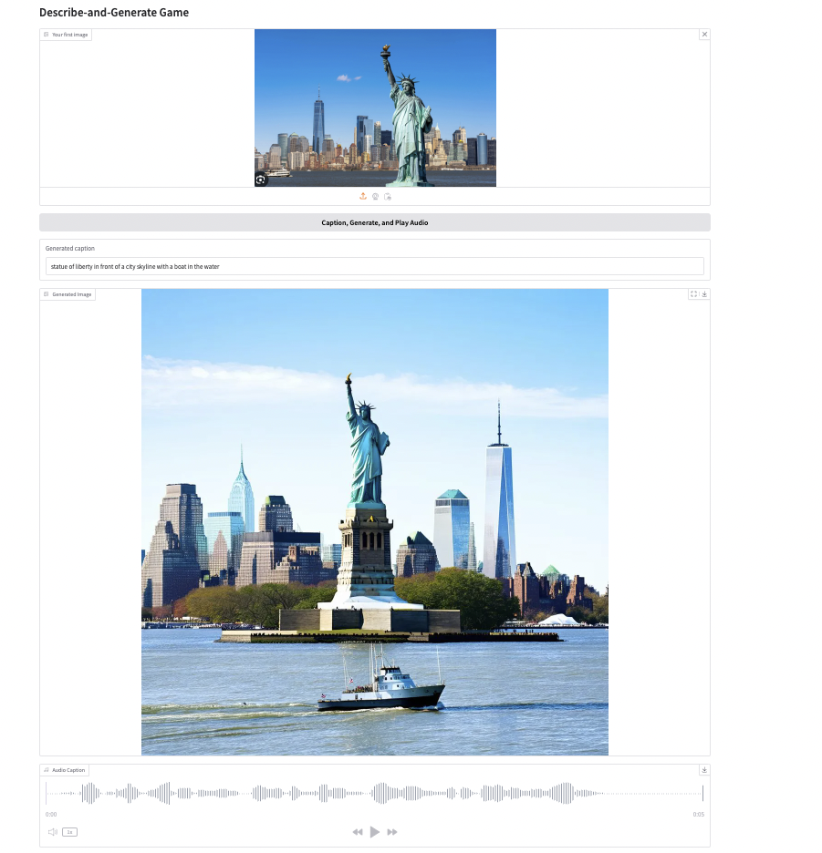
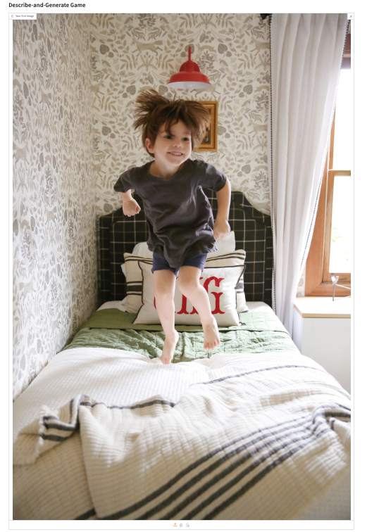
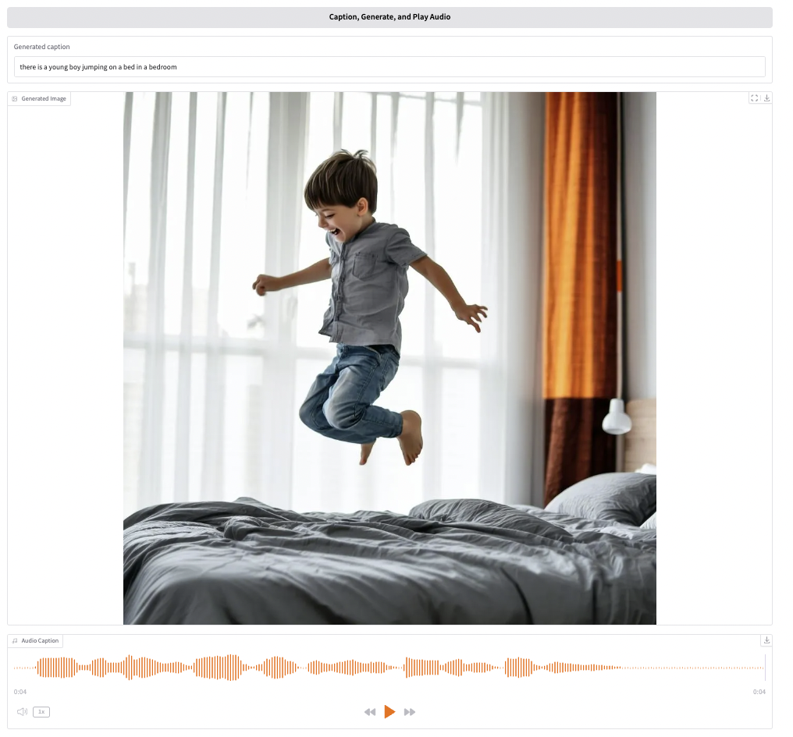

# Describe-and-Generate Game

## Introduction
An AI-powered web application that transforms uploaded images into new artistic interpretations through a chain of AI models. The app generates captions for uploaded images, creates new images based on these captions, and provides audio descriptions of the results.


## Design
Three-component system:
- Image Captioning: BLIP model for image understanding
- Image Generation: Stable Diffusion for creating new images
- Audio Synthesis: gTTS for voice output
- Interface: Gradio for web interaction

## Implementation
```bash
# Requirements
pip install Pillow requests python-dotenv gradio gtts

# Environment Setup
hf-general-api-key=your_key
itt-blip-model=your_endpoint
tti-diffusion-model=your_endpoint
```

Core workflow:
1. Upload image → BLIP caption
2. Caption → Stable Diffusion image
3. Caption → gTTS audio
4. Display all results

## Testing
1. Clone and install:
```bash
git clone [repository-url]
cd [gen-ai-game/src]
pip install -r requirements.txt  # after setting up virtual environment
```

2. Run:
```bash
python app.py
```
3. Test Demo's
 

## Future Enhancements
- Multiple language support
- Style transfer options
- Image comparison tools
- Batch processing
- Performance optimization

## References
- [Hugging Face API](https://huggingface.co/docs/api-inference/index)
- [Gradio Docs](https://gradio.app/docs/)
- [Project Repository](https://github.com/juma-paul/customer-support-chatbot/tree/main/gen-ai-game)
- [Presentation](https://docs.google.com/presentation/d/1mawC_eTT0Pzs4y4W9_1oyD9cLehZ88QhHc79II1TXrU/edit?usp=sharing)