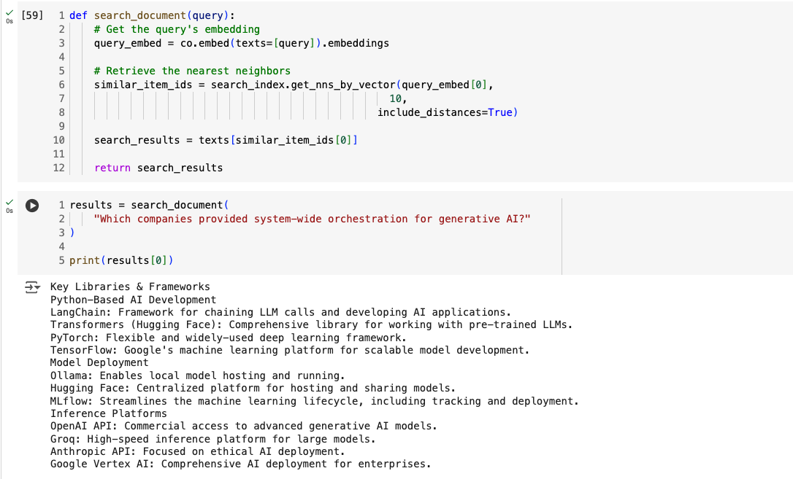

# Generative AI: Intelligent Question Answering System

## Introduction
This project demonstrates a comprehensive pipeline for generating answers from a given text corpus using state-of-the-art generative AI techniques. The system transforms raw text into an intelligent question-answering tool through advanced natural language processing methods.

## Design
The solution follows a structured workflow:
1. **Input Text**: Source document on Generative AI landscape
2. **Chunking**: Split text into meaningful paragraphs
3. **Embedding**: Convert text chunks into vector representations
4. **Search Index**: Create an indexable vector database
5. **Query Processing**: Semantic search for relevant context
6. **Answer Generation**: Use LLM to generate precise answers

## Implementation
### Key Technologies
- **Embedding**: Cohere API for vector generation
- **Indexing**: Annoy library for nearest neighbor search
- **Generation**: Cohere's generative AI model
- **Language**: Python

### Core Functions
- `search_document()`: Semantic search across text corpus
- `ask_question_about_document()`: Generate contextual answers
- Supports flexible querying with configurable parameters

## Testing
- Demonstrated with multiple query types
- Handles scenarios:
  - Direct information retrieval
  - Contextual understanding
  - Graceful handling of unavailable information

## Enhancement Ideas
1. Integrate multiple text sources
2. Implement more advanced embedding techniques
3. Add confidence scoring for answers
4. Create a web/CLI interface
5. Support multi-language processing

## Conclusion
This project showcases the potential of generative AI in creating intelligent, context-aware question-answering systems by leveraging advanced NLP techniques.

## References
- Cohere API Documentation
- Annoy Library
- Generative AI Landscape Overview

## Setup and Execution
1. Install dependencies: `pip install cohere python-dotenv annoy`
2. Configure API keys in `.env`
3. Run the Jupyter notebook

## License
- MIT License

## Project Repository
- View Project on GitHub [here](https://github.com/juma-paul/customer-support-chatbot/tree/main/generating-answers)

## Presentation slides
- View Presentation slides [here](https://docs.google.com/presentation/d/1aQCaPJbAp7ZosUXjZKwmQepIQ1Db57Tc5k64fsaF37Q/edit?usp=sharing)
