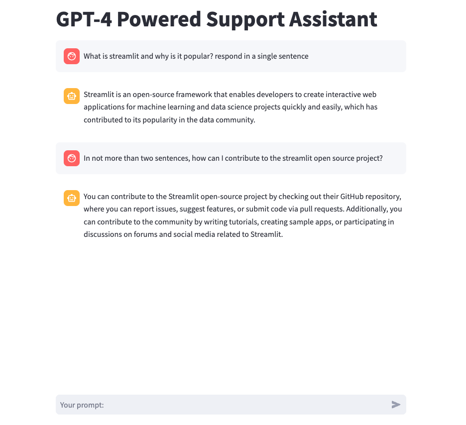

# GPT-4 Powered Chat Assistant

A sophisticated GPT-4 powered support assistant built using OpenAI API and Streamlit, offering an intelligent, interactive chat experience for users.



## Project Overview

This project demonstrates the creation of an AI-powered chatbot leveraging OpenAI's GPT-4 and Streamlit. The assistant responds to user inputs in real-time, providing helpful and intelligent responses, showcasing the potential of advanced language models in interactive applications.

## Presentation

Please find the link to the presentation slides [here](https://docs.google.com/presentation/d/1efSl1jdeQtEUa-xRaKwTkuoht7bbX2plkDTUQRNYBnA/edit?usp=sharing). The slides provide an overview of the project, including its design, implementation, testing, and future enhancements.

## Key Technologies

- OpenAI GPT-4
- Streamlit (for UI)
- Python 3.7+ (backend)
- python-dotenv (for environment variables)

## Features

- Real-time chat interface
- GPT-4 powered responses
- Persistent chat history within session
- Streaming responses for enhanced user experience
- Easy-to-use web interface

## Prerequisites

- Python 3.7 or above
- OpenAI API key

## Installation

1. Clone the repository:
   ```bash
   git clone https://github.com/juma-paul/customer-support-chatbot.git
   cd customer-support-chatbot/gpt-4-chat-assistant
   ```

2. Install required packages:
   ```bash
   pip install -r requirements.txt
   ```

3. Set up environment variables:
   Create a `.env` file in the root directory and add your OpenAI API key:
   ```
   openai_api_key=your_openai_api_key_here
   ```

## Usage

1. Start the Streamlit app:
   ```bash
   streamlit run app.py
   ```

2. Open your web browser and go to `http://localhost:8501/`

3. Start chatting with the AI assistant!

## Configuration

- `MODEL_NAME`: Set to "gpt-4o-mini" by default. Modify this to use different OpenAI models.
- Environment variables: Stored in `.env` file (not tracked by Git for security reasons)

## Enhancement Ideas

1. **Multi-Turn Conversations**: Implement a memory feature to hold conversations across multiple sessions.
2. **Tone Adjustment**: Introduce sentiment analysis to adjust the chatbot's tone dynamically.
3. **Scalability**: Integrate a database to store conversation history for future use or analytics.
4. **User Customization**: Allow users to change the assistant's voice or language based on preferences.
5. **Error Handling**: Implement more robust error handling and user feedback mechanisms.
6. **API Key Management**: Develop a secure way to manage and rotate API keys.
7. **Performance Optimization**: Implement caching mechanisms to reduce API calls for repeated queries.

## Contributing

Contributions are welcome! Please feel free to submit a Pull Request.

1. Fork the repository
2. Create your feature branch (`git checkout -b feature/<your_new_feature>`)
3. Commit your changes (`git commit -m 'Add some <commit message>'`)
4. Push to the branch (`git push origin feature/<your_new_feature>`)
5. Open a Pull Request

## License

This project is licensed under the MIT License. See the [LICENSE](https://choosealicense.com/licenses/mit/) file for details.

## Acknowledgements

- OpenAI for providing the GPT-4 API.
- Streamlit for their excellent framework for building interactive web applications.

## GitHub Repository

Access the complete project and source code [here](https://github.com/juma-paul/customer-support-chatbot/tree/main/gpt4-mini-chatbot-streamlit).