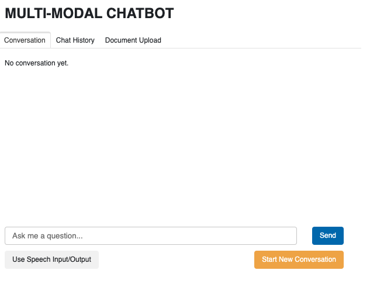
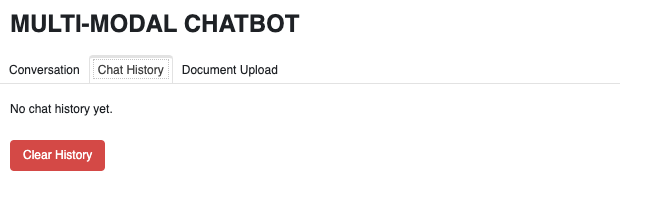
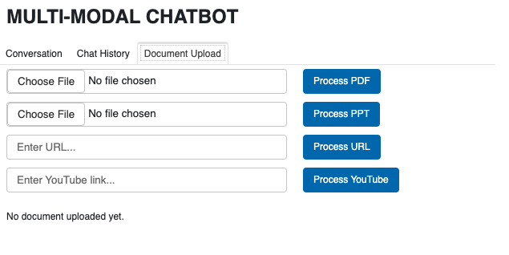

# Multi-Modal Chatbot

## Overview
The **Multi-Modal Chatbot** is a web-based AI application that enhances customer support through multimodal interactions. It supports both **text and voice** communication and utilizes document-based context retrieval for improved responses.



## Key Features
- **Multimodal Interaction**: Supports both text and voice inputs/outputs.
- **Advanced AI Capabilities**:
  - **Speech Recognition**: Converts speech to text (Whisper API).
  - **Text Generation**: Contextual responses using GPT-4o-mini.
  - **Text-to-Speech Synthesis**: Converts text responses to speech (OpenAI TTS).
- **Intelligent Document Processing**:
  - Upload and query **PDFs**, **PowerPoint**, **web pages**, **YouTube videos**.
  - **Retrieval-Augmented Generation (RAG)** workflow for document-based Q&A.
- **Conversational Intelligence**:
  - **Contextual Memory**: Remembers prior interactions.
  - **Stateful Conversation Tracking**: Maintains conversation flow and context.

## Example Use Cases
- **Voice Interaction:** Click **Use Speech Input/Output**, say the wake word (**hey computer**) and then query, and receive an audio response.
- **Start New Conversation:** Reset the chat session with **Start New Conversation** while keeping the chat history intact.
- **Document-Based Q&A:** Upload documents and ask questions based on their content.

## Technical Architecture
- **Core Technologies**:
  - **Python**
  - **Panel** (Web interface)
  - **LangChain** (Document retrieval and Q&A)
  - **OpenAI APIs** (GPT-4o-mini, Whisper, OpenAI TTS)
- **Document Storage**: **Chroma Vector Store** for efficient document indexing and retrieval.
- **Processing Libraries**:
  - **PyPDF2** (PDF processing)
  - **UnstructuredPowerPointLoader** (PowerPoint processing)
  - **WebBaseLoader** (Web page processing)
  - **YoutubeAudioLoader** (YouTube video processing)

## User Interface Sections
1. **Conversation Tab**:
   - Input queries (text or speech).
   - Displays AI responses.
2. **Chat History Tab**:
  - View and clear previous conversations



3. **Document Upload Tab**:
  - Upload documents to populate the vector database for better query answering.



## Getting Started
### Prerequisites
- Python environment.
- OpenAI API key.

### Installation Steps
```bash
# Clone repository
git clone [repository-url]
cd multi-model-chatbot # activate virtual environment

# Install dependencies
pip install -r requirements.txt

# Launch application
panel serve chatbot.py --autoreload
```

## Repository Link
You can access the full codebase and contribute to the project via [GitHub]().


