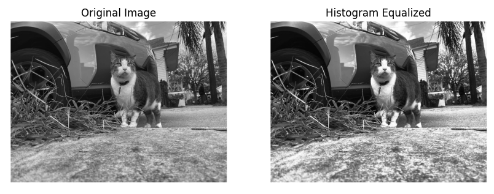

# Image Histogram Equalization

## Overview

This Python implementation provides a powerful image processing technique for enhancing image contrast through histogram equalization. The library transforms grayscale images by redistributing pixel intensities to achieve a more balanced and visually appealing result.



## Features

- Grayscale image processing
- Dynamic histogram calculation
- Contrast enhancement
- Flexible image loading and saving
- Visualization of original and transformed images

## Requirements

- NumPy
- Pillow (PIL)
- Matplotlib

## Quick Start

1. Clone the repository:
```bash
git clone https://github.com/your-username/histogram-equalization
cd histogram-equalization
```

2. Install dependencies:
```bash
pip install numpy pillow matplotlib
```

3. Run the script:
```bash
python3 histogram_equalization.py
```

## Key Functions

- `histogram()`: Calculates pixel value distribution
- `apply_histogram_equalization()`: Enhances image contrast
- `from_image_file()`: Loads images from file
- `display_images()`: Visualizes transformation results

## Example Usage

```python
image_file_path = "/content/nola-cat.png"

# Load the image and convert it to grayscale
image_from_file = Image.from_image_file(image_file_path)

# Apply histogram equalization
transformed_pixels = image_from_file.apply_histogram_equalization()

# Display original and transformed images
original_img = PILImage.open(image_file_path).convert('L')
display_images(original_img, transformed_pixels)
```

## License

MIT License

## Contributing

Contributions are welcome! Please open an issue or submit a pull request.

## References

- Histogram Equalization in Digital Image Processing [Link to Resource]

## Project Repository

[View Project on GitHub](https://github.com/your-username/histogram-equalization)