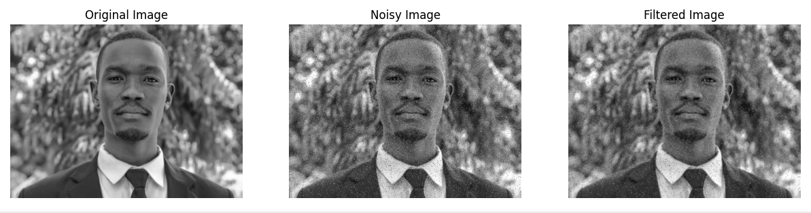

# Gaussian Noise Reduction in Images

## Overview

This Python implementation demonstrates noise reduction techniques using Gaussian filtering, providing a robust method to remove salt-and-pepper noise from grayscale images using advanced image processing algorithms.



## Features

- Salt-and-pepper noise generation
- Gaussian kernel creation
- Adaptive noise filtering
- Side-by-side image visualization
- Customizable noise and filter parameters

## Requirements

- NumPy
- OpenCV
- Matplotlib

## Quick Start

1. Clone the repository:
```bash
git clone https://github.com/your-username/gaussian-noise-reduction.git
cd gaussian-noise-reduction
```

2. Install dependencies:
```bash
pip install numpy opencv-python matplotlib
```

3. Run the script:
```bash
python3 noise_reduction.py
```

## Functions

- `apply_gaussian_filter()`: Apply Gaussian noise reduction
- `generate_gaussian_kernel()`: Create adaptive Gaussian kernels
- `add_salt_and_pepper_noise()`: Simulate image noise
- `plot_images()`: Visualize image transformation stages

## Example Usage

```python
image = cv2.imread('sample_image.jpg', cv2.IMREAD_GRAYSCALE)
noisy_image = add_salt_and_pepper_noise(image)
kernel = generate_gaussian_kernel(size=3, sigma=1.0)
filtered_image = apply_gaussian_filter(noisy_image, kernel)
plot_images(original=image, noisy=noisy_image, filtered=filtered_image)
```

## License

MIT License

## Contributing

Contributions are welcome! Please open an issue or submit a pull request.

## References

- Gaussian Filtering in Image Processing [Link [here](https://en.wikipedia.org/wiki/Gaussian_filter)]

## Resources
- Project Link [here](https://github.com/your-username/gaussian-noise-reduction)