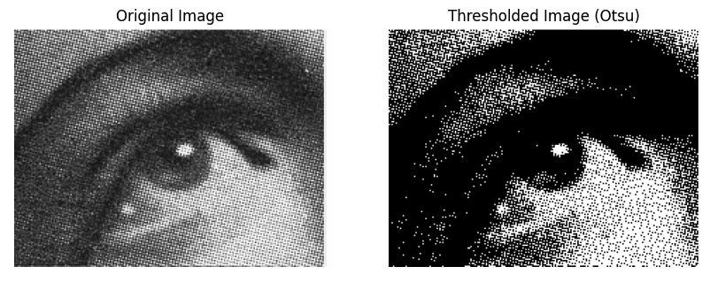

# Otsu's Thresholding Image Segmentation

## Overview

This Python implementation provides a robust image segmentation technique using Otsu's method, an adaptive thresholding algorithm that automatically determines the optimal threshold for separating foreground and background in grayscale images.



## Features

- Automatic threshold calculation
- Optimal image binarization
- Works well with noisy images
- Visualizes original and transformed images

## Requirements

- NumPy
- OpenCV
- Matplotlib

## Quick Start

1. Clone the repository:
```bash
git clone https://github.com/yourusername/otsu-thresholding.git
```

2. Install dependencies:
```bash
pip install numpy opencv-python matplotlib
```

3. Run the script:
```bash
python otsu_thresholding.py
```

## Functions

- `otsu_thresholding()`: Calculates optimal threshold
- `apply_threshold()`: Applies binary thresholding
- `display_images()`: Visualizes transformation

## Example Usage

```python
image = cv2.imread('sample_image.png', cv2.IMREAD_GRAYSCALE)
threshold = otsu_thresholding(image)
binary_image = apply_threshold(image, threshold)
display_images(image, binary_image)
```

## License

MIT License

## Contributing

Contributions are welcome! Please open an issue or submit a pull request.

## References

- A threshold selection method from gray-level histograms [Link [here](https://ieeexplore.ieee.org/document/4310076)]

## Resources
- Project Link [here]()