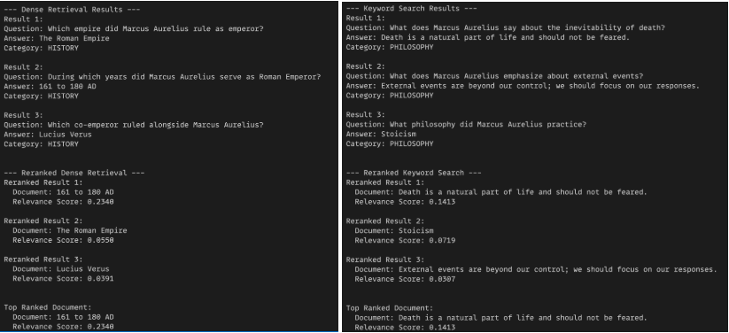

# Keyword and Semantic Searches with ReRank
## Introduction
This project demonstrates the use of keyword-based and semantic-based searches with a reranking mechanism to retrieve relevant information from a collection of data about the Roman emperor Marcus Aurelius and his philosophical teachings.

## Design
The project utilizes the Weaviate vector database to store the data, which includes questions, answers, and categories. The data is indexed using OpenAI's text embedding model for semantic search and BM25 for keyword search. Additionally, the Cohere reranking API is used to further refine the search results based on relevance to the user's query.

## Implementation
The main components of the implementation are:

- **Data Ingestion:** The data is loaded from a JSON file and inserted into the Weaviate database.
- **Dense Retrieval:** Semantic-based search using the Weaviate vector database.
- **Keyword Search:** Keyword-based search using Weaviate's BM25 functionality.
- **Reranking:** The Cohere reranking API is used to further refine the search results based on relevance to the user's query.

## Test
The project is tested by running sample queries and verifying the accuracy and relevance of the search results, both before and after reranking.

## Enhancement Ideas

- **Multilingual Support:** Extend the system to handle queries and data in multiple languages.
- **Contextual Understanding:** Incorporate more advanced natural language processing techniques to better understand the context and intent behind the user's queries.
- **Interactive User Interface:** Develop a user-friendly web application or chatbot interface to allow users to easily interact with the system.

## Conclusion
This project demonstrates the power of combining keyword-based and semantic-based search techniques, along with a reranking mechanism, to effectively retrieve relevant information from a knowledge base. The insights gained from this project can be applied to a wide range of information retrieval and knowledge management applications.

## References

 - [Weaviate documentation](https://www.semi.technology/developers/weaviate/current/index.html)
- [Cohere Reranking API](https://docs.cohere.ai/reference/rerank)
- [Marcus Aurelius and Stoicism](https://www.iep.utm.edu/marcus-a/)

## Resources
- [Presentation Slides](https://docs.google.com/presentation/d/1JGqyIgRRp9yaHgvXKaToPQoJGYR2eBiTYu72WKRsTtI/edit?usp=sharing)
- [Github Repository]()